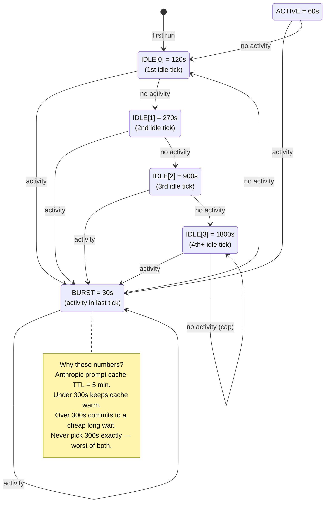
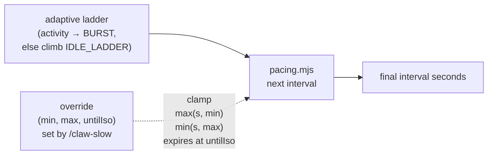
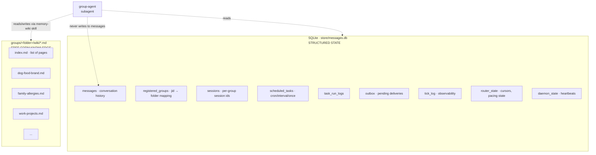
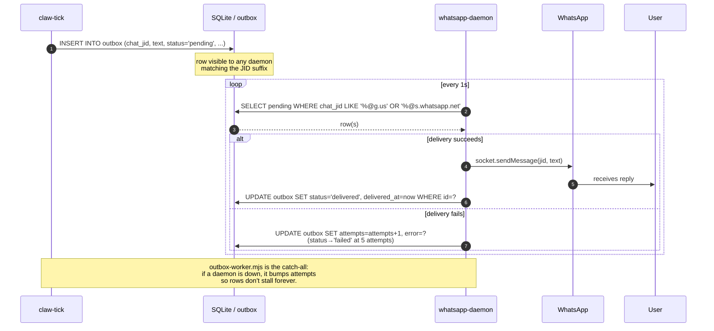
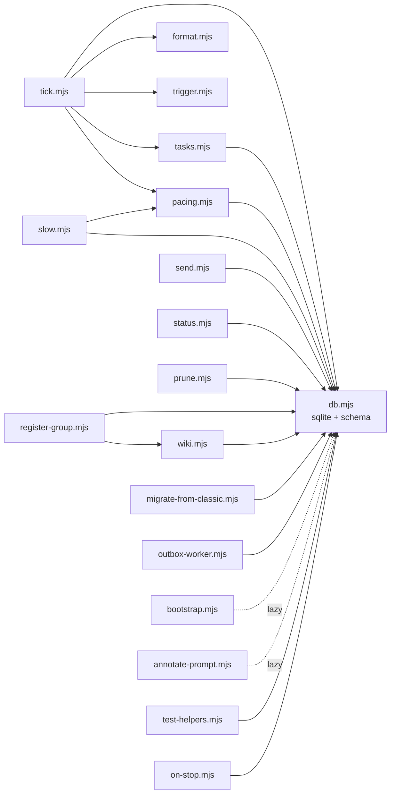
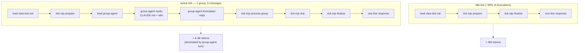
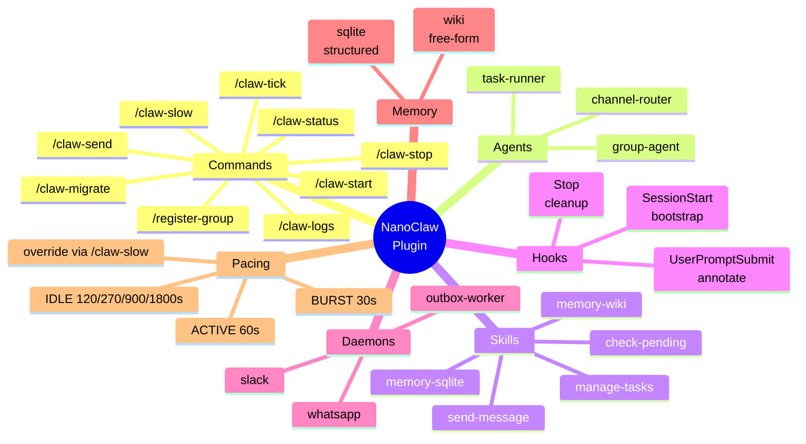

# NanoClaw Plugin — Visual Guide

How the pieces fit together. Companion to [`PLUGIN_ARCHITECTURE.md`](./PLUGIN_ARCHITECTURE.md).

All diagrams are Mermaid — they render inline on GitHub, VS Code (with the Mermaid extension), and most markdown previewers.

---

## 1. High-level system

One Claude Code session runs `/loop /claw-tick`. Two small Node daemons hold the persistent channel connections. A shared SQLite file is the only IPC between them.

```mermaid
flowchart LR
    subgraph ext["External services"]
        WA[WhatsApp Cloud]
        SL[Slack]
    end

    subgraph daemons["Persistent Node daemons"]
        WAD[whatsapp-daemon.ts<br/>Baileys / Socket Mode]
        SLD[slack-daemon.ts<br/>@slack/bolt / Socket Mode]
        OW[outbox-worker.mjs<br/>catch-all retry]
    end

    subgraph store["SQLite · store/messages.db"]
        M[(messages)]
        OB[(outbox)]
        RG[(registered_groups)]
        RS[(router_state)]
        TL[(tick_log)]
        ST[(scheduled_tasks)]
        DS[(daemon_state)]
        WP[(wiki_pages)]
    end

    subgraph cc["Claude Code session"]
        LOOP["/loop /claw-tick"]
        TICK[claw-tick.md<br/>command]
        GA(group-agent subagent)
        TR(task-runner subagent)
    end

    subgraph fs["Filesystem"]
        CMD[groups/&lt;folder&gt;/CLAUDE.md]
        WIKI[groups/&lt;folder&gt;/wiki/*.md]
    end

    WA <-.socket.-> WAD
    SL <-.socket.-> SLD

    WAD -->|storeMessage| M
    SLD -->|storeMessage| M
    WAD -->|storeChatMetadata| RG
    SLD -->|storeChatMetadata| RG

    OB -->|poll & deliver| WAD
    OB -->|poll & deliver| SLD
    OW -.catch stuck rows.-> OB

    LOOP --> TICK
    TICK -->|prepare| M
    TICK -->|prepare| RG
    TICK -->|prepare| RS
    TICK -->|finalize| TL
    TICK -->|finalize, idle-hint| RS
    TICK --> GA
    TICK --> TR
    GA -.reads.-> CMD
    GA -.reads & writes.-> WIKI
    TR --> ST
    TICK -->|process-group<br/>reply + advance| OB
    TICK -->|process-group| RS
```

**Key invariants**

- Daemons never call Claude. They only bridge channel ↔ SQLite.
- SQLite is the single source of truth. No shared memory, no socket RPC between daemons and the tick.
- The Claude Code session is the agent. Per-group isolation comes from invoking the `group-agent` subagent with that group's `CLAUDE.md` + wiki context.

---

## 2. Tick sequence — idle vs active

Most ticks are idle. The design is optimized for that case: one bash call, one short reply, no subagents loaded.

```mermaid
sequenceDiagram
    autonumber
    participant Loop as /loop
    participant Tick as claw-tick.md
    participant DB as tick.mjs / sqlite
    participant GA as group-agent<br/>(subagent)
    participant TR as task-runner<br/>(subagent)

    Loop->>Tick: invoke
    Tick->>DB: tick.mjs prepare

    alt no pending messages  (idle, ~95% of ticks)
        DB-->>Tick: { tickId, groups: [] }
        Tick->>DB: finalize 0 0
        DB-->>Tick: { pacing: { seconds: 120..1800 } }
        Tick-->>Loop: "idle · next in 270s"
    else one or more groups pending  (active)
        DB-->>Tick: { tickId, groups: [...] }
        loop per group
            Tick->>GA: Agent(folder, isMain, messagesXml)
            GA-->>Tick: reply string
            Tick->>DB: process-group {jid, reply, latestTimestamp}
            Note right of DB: atomic:<br/>strip &lt;internal&gt;,<br/>enqueue outbox,<br/>advance cursor
        end
        Tick->>DB: due
        DB-->>Tick: scheduled tasks (may be empty)
        opt any due
            Tick->>TR: Agent(tasks JSON)
            TR-->>Tick: results
        end
        Tick->>DB: finalize N M
        DB-->>Tick: { pacing: { seconds: 30 } }
        Tick-->>Loop: "tick #42 · 2 groups · 5 msgs · next in 30s"
    end
```

**What's deliberately absent on the idle path:** skill loading, file reads, subagent spawning, wiki access. An idle tick finishes in well under a second and costs only the tokens in the tiny `claw-tick.md` + a one-line reply.

---

## 3. Adaptive pacing state machine

`pacing.mjs` decides how long `/loop` waits before the next tick. The state lives in `router_state.pacing_state`. A user-supplied override in `router_state.pacing_override` (set via `/claw-slow`) clamps the result.



Override semantics:



`/claw-slow` presets:

| Preset  | Min    | Max    | When                             |
|---------|--------|--------|----------------------------------|
| `burst` | 30s    | 60s    | Actively working with assistant  |
| `normal` | —     | —      | (clears override; adaptive only) |
| `slow`  | 10m    | 30m    | Background, focus time           |
| `away`  | 30m    | 60m    | Overnight / weekend              |
| `clear` | —      | —      | Remove override                  |

---

## 4. Memory model — SQLite vs Wiki

NanoClaw splits durable state into two stores with different roles.



**Rule of thumb**

- Structured or mechanical → SQLite. Things with a schema, a cursor, a time window, or a status field.
- Free-form knowledge → Wiki. Decisions, preferences, people, plans; anything you'd want to remember weeks later as prose.
- The wiki is authoritative — SQLite's `wiki_pages` is just a search-friendly cache.

---

## 5. Inbound message lifecycle

```mermaid
sequenceDiagram
    autonumber
    participant User
    participant WA as WhatsApp
    participant D as whatsapp-daemon
    participant DB as SQLite
    participant L as /loop
    participant T as claw-tick
    participant A as group-agent

    User->>WA: types "@Andy what time is it?"
    WA->>D: message event (Baileys WebSocket)
    D->>DB: storeMessage(msg) + storeChatMetadata(jid)
    Note over D,DB: no Claude involved yet

    L->>T: next tick fires
    T->>DB: tick.mjs prepare
    DB-->>T: groups: [{ jid, messagesXml, latestTimestamp, ... }]
    T->>A: Agent("main", isMain=true, messagesXml)
    A->>A: read groups/main/CLAUDE.md
    A->>A: skim wiki/index.md
    A-->>T: "It's 14:23 UTC."
    T->>DB: process-group {jid, reply, latestTimestamp}
    Note over DB: transaction:<br/>strip &lt;internal&gt;,<br/>enqueue outbox row,<br/>advance cursor
    T->>DB: finalize → pacing.seconds = 30
    T-->>L: "tick #42 · 1 group · 1 msg · next in 30s"
```

---

## 6. Outbound reply lifecycle



---

## 7. Plugin layout

```mermaid
graph TB
    classDef manifest fill:#fffbe6,stroke:#b5a100
    classDef cmd fill:#eef7ff,stroke:#4a90e2
    classDef agent fill:#efe7ff,stroke:#7a5bd3
    classDef skill fill:#eafbee,stroke:#3ea760
    classDef script fill:#fdecec,stroke:#b63939
    classDef test fill:#fafafa,stroke:#888,stroke-dasharray: 3 3

    ROOT[plugin/]
    ROOT --> PJ[plugin.json]:::manifest
    ROOT --> HJ[hooks.json]:::manifest
    ROOT --> PKG[package.json]:::manifest

    ROOT --> CMDS[commands/]
    CMDS --> C1[claw-tick]:::cmd
    CMDS --> C2[claw-start]:::cmd
    CMDS --> C3[claw-stop]:::cmd
    CMDS --> C4[claw-status]:::cmd
    CMDS --> C5[claw-slow]:::cmd
    CMDS --> C6[claw-send]:::cmd
    CMDS --> C7[claw-logs]:::cmd
    CMDS --> C8[claw-migrate]:::cmd
    CMDS --> C9[register-group]:::cmd

    ROOT --> AGS[agents/]
    AGS --> A1[group-agent]:::agent
    AGS --> A2[channel-router]:::agent
    AGS --> A3[task-runner]:::agent

    ROOT --> SKS[skills/]
    SKS --> S1[memory-wiki]:::skill
    SKS --> S2[memory-sqlite]:::skill
    SKS --> S3[send-message]:::skill
    SKS --> S4[check-pending]:::skill
    SKS --> S5[manage-tasks]:::skill

    ROOT --> SCR[scripts/]
    SCR --> SC1[db.mjs]:::script
    SCR --> SC2[wiki.mjs]:::script
    SCR --> SC3[format.mjs]:::script
    SCR --> SC4[trigger.mjs]:::script
    SCR --> SC5[tasks.mjs]:::script
    SCR --> SC6[tick.mjs]:::script
    SCR --> SC7[pacing.mjs]:::script
    SCR --> SC8[slow.mjs]:::script
    SCR --> SC9[send.mjs]:::script
    SCR --> SC10[logs.mjs]:::script
    SCR --> SC11[status.mjs]:::script
    SCR --> SC12[prune.mjs]:::script
    SCR --> SC13[register-group.mjs]:::script
    SCR --> SC14[migrate-from-classic.mjs]:::script
    SCR --> SC15[bootstrap.mjs]:::script
    SCR --> SC16[on-stop.mjs]:::script
    SCR --> SC17[annotate-prompt.mjs]:::script
    SCR --> SC18[outbox-worker.mjs]:::script
    SCR --> SC19[whatsapp-daemon.ts]:::script
    SCR --> SC20[slack-daemon.ts]:::script
    SCR --> SC21[test-helpers.mjs]:::test
    SCR --> SC22["*.test.mjs (25 files)"]:::test
```



---

## 8. Script dependency graph

Who imports whom. Keeps you oriented when touching a module.



---

## 9. Hooks triggering

```mermaid
sequenceDiagram
    participant CC as Claude Code
    participant SS as bootstrap.mjs<br/>(SessionStart)
    participant UP as annotate-prompt.mjs<br/>(UserPromptSubmit)
    participant SH as on-stop.mjs<br/>(Stop)
    participant DB as SQLite

    CC->>SS: session opens
    SS->>DB: migratePluginSchema (idempotent)
    SS->>SS: spawn whatsapp/slack/outbox daemons if not alive
    SS-->>CC: JSON report (stdout)

    loop each user prompt
        CC->>UP: JSON {prompt, ...} on stdin
        UP->>UP: shouldPoll()? (cheap fs stat)
        alt DB present & non-empty
            UP-. dynamic import .->DB
            UP->>DB: getGroupsWithPending
            DB-->>UP: list
            UP-->>CC: JSON with prompt + <nanoclaw-status> suffix
        else fresh install
            UP-->>CC: JSON unchanged (no DB load)
        end
    end

    CC->>SH: session ends
    SH->>DB: UPDATE daemon_state SET status='stopped'
    SH->>SH: SIGTERM each daemon pid
    SH-->>CC: JSON report
```

---

## 10. Tick token cost (why the fast path matters)

Approximate context used per tick in each branch. Cache-warm assumption for tokens that persist across the `/loop`.



On a laptop running `/loop /claw-tick` all day:
- Without adaptive pacing: 1440 idle ticks/day × 400 tokens ≈ 580k tokens.
- With adaptive pacing (mostly 270s/900s/1800s rungs): ~40–80 idle ticks/day × 400 ≈ 16–32k tokens.
- Active ticks always cost the same ~5k; what changes is how many idle ticks we skip.

---

## 11. Where does each requirement map?

| Original NanoClaw code | Plugin replacement | Notes |
|---|---|---|
| `src/index.ts` `startMessageLoop` | `/loop /claw-tick` + `tick.mjs` | Loop lives in Claude Code, not Node |
| `src/index.ts` `processGroupMessages` | `plugin/agents/group-agent.md` | Per-group subagent |
| `src/router.ts` `formatMessages` | `plugin/scripts/format.mjs` | Ported verbatim |
| `src/config.ts` trigger pattern | `plugin/scripts/trigger.mjs` | Ported verbatim |
| `src/task-scheduler.ts` | `plugin/scripts/tasks.mjs` + `task-runner` agent | CLI + subagent |
| `src/db.ts` tables | unchanged + additive migrations | `outbox`, `tick_log`, `wiki_pages`, `daemon_state` added |
| `src/ipc.ts` file-based IPC | SQLite `outbox` table | No more JSON drop folder |
| `src/channels/whatsapp.ts` | `plugin/scripts/whatsapp-daemon.ts` | Imports & wraps the class |
| `src/channels/slack.ts` | `plugin/scripts/slack-daemon.ts` | Imports & wraps the class |
| `src/container-runner.ts` | — (intentionally dropped) | No per-group containers |
| `src/remote-control.ts` | — (intentionally dropped) | Out of scope |

---

## 12. Quick reference



---

## Reading order

New to the plugin? Read in this order:

1. This file (visual) — 10 min
2. [`PLUGIN_ARCHITECTURE.md`](./PLUGIN_ARCHITECTURE.md) — design doc — 15 min
3. [`../plugin/README.md`](../plugin/README.md) — install + operations — 10 min
4. [`../plugin/commands/claw-tick.md`](../plugin/commands/claw-tick.md) — the heart of the loop — 5 min

Then dip into scripts as needed; each has a top-of-file header explaining its job.
